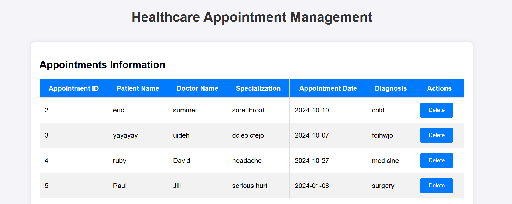
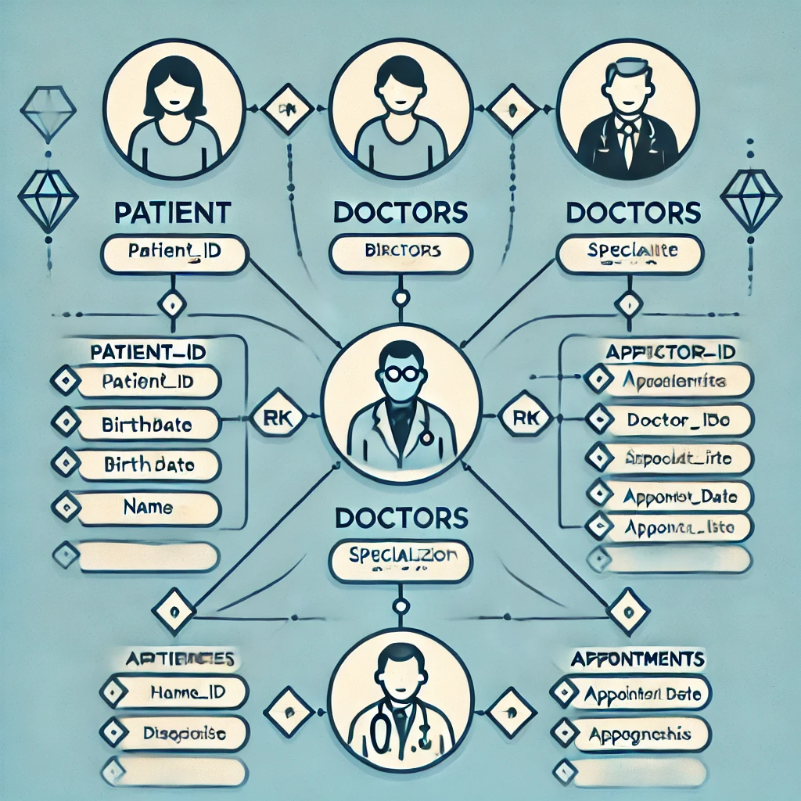

## Files Overview
* create_database.py: A Python script to create the required MySQL database and tables for this application, including tables for patients, doctors, and appointments.
* app.py: The main Flask application file, which defines the routes for viewing, adding, and deleting appointments.
* templates/appointments.html: The HTML template used to display the list of appointments in a table format, with options to add and delete appointments.

## Steps to Set Up and Run the Project
1. Set Up the MySQL Database
Run create_database.py to create a MySQL database named user_data and tables for appointments, patients, and doctors.
This script will set up the schema required by the Flask application to perform CRUD operations on the data.

2. Flask Application (app.py)
app.py is the core of this project, handling the routing logic for:

Displaying the list of appointments
Adding new appointments
Deleting existing appointments
The application connects to the MySQL database, retrieves data, and renders it in appointments.html.

3. HTML Form (templates/appointments.html)
appointments.html is the user interface where users can view all appointments in a table.
It includes forms to add new appointments and delete existing ones.
Make sure to place this file inside the templates folder in your project directory.

4. Run the Flask Application
Start the Flask server by running:
** python app.py **
Open your web browser and navigate to http://127.0.0.1:5000/appointments to access the application.

